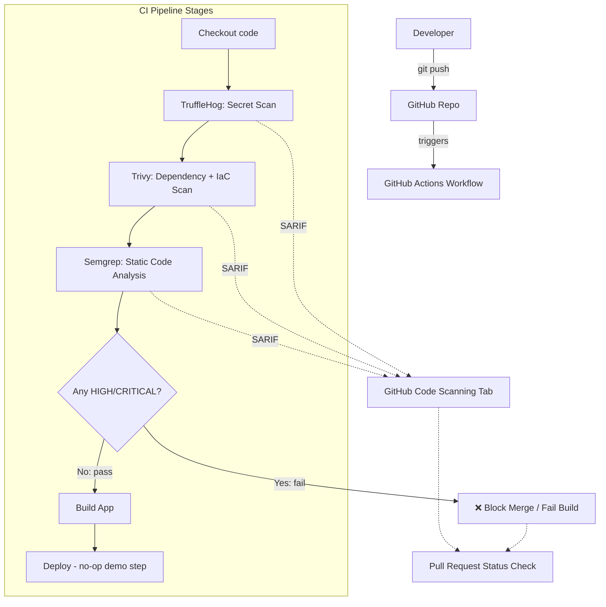

# Project 5 — Automated DevSecOps CI/CD Security Pipeline
> Aligns with: Cloud / Automation / AppSec
> File purpose: Paste this entire document into your agentic coding IDE as the first message. Self-contained — do not mix with other project files.

---

## 0. CONTEXT ANCHOR

**Mission:** Build a sample web application + a GitHub Actions pipeline that automatically scans every push for secrets, vulnerable dependencies, and code-quality/security issues — and **blocks the merge/deploy** if a high-severity issue is found.

**In scope:**
- A small, deliberately-imperfect sample web app (e.g., a simple Flask or Node/Express app) used purely as a scan target
- GitHub Actions workflow triggered on `push` and `pull_request`
- Secret scanning: **TruffleHog** (open-source)
- Dependency/SCA scanning: **Trivy** (open-source, also does container image + IaC scanning — big value-add over just Snyk)
- Static Application Security Testing (SAST): **SonarQube Community Edition** (self-hosted via Docker, free) or **Semgrep** (open-source, faster to wire into GitHub Actions with no server needed — recommend Semgrep as primary, SonarQube as a stretch goal)
- Pipeline gate: build fails / PR is blocked from merging if any HIGH/CRITICAL finding is present, using branch protection rules requiring the status check to pass
- A results dashboard: GitHub Actions job summary (Markdown) showing a clean pass/fail table, plus SARIF upload to GitHub Code Scanning (native, free, renders findings directly in the PR)

**Out of scope:**
- No paid Snyk tier — Trivy fully replaces it here (explicitly note in docs "swapped Snyk for Trivy — same category of tool, fully open source")
- No production deployment target needed — the "deploy" step can be a no-op/echo, the point is the security gate, not the app itself
- Don't over-engineer the sample app — it exists only to have something to scan (intentionally include 1–2 known-vulnerable dependencies and 1 fake hardcoded "secret" to prove detection works)

**Hard constraints:**
- GitHub Actions free tier minutes (2,000/month free for public repos, effectively unlimited for a portfolio repo)
- 100% open-source scanners

**Definition of done:** Push a commit containing a fake secret (e.g., a dummy AWS key format string) and a known-vulnerable dependency version → pipeline fails, PR shows blocked status, GitHub Code Scanning tab shows the findings with SARIF annotations.

---

## 1. High-Level Architecture



**Narrative:** This is the "shift-left" security model — every scanner runs before build/deploy, and each tool's findings are normalized to the SARIF format so they all surface in one place (GitHub's native Code Scanning UI), rather than three separate disconnected reports. The `Gate` step is the actual DevSecOps enforcement point — this is what separates "we ran a scanner once" from "security is a hard requirement in our delivery pipeline."

---

## 2. Low-Level Design

### 2.1 Repository structure
```
devsecops-pipeline-demo/
├── README.md
├── app/                                # sample vulnerable-by-design web app
│   ├── requirements.txt                # intentionally includes 1 outdated/vulnerable package
│   ├── app.py
│   └── config_example.py               # contains a FAKE, clearly-labeled dummy secret pattern
├── .github/
│   └── workflows/
│       ├── security-pipeline.yml       # main pipeline
│       └── nightly-full-scan.yml       # optional deeper scheduled scan
├── .semgrep.yml                        # Semgrep ruleset config
├── .trivyignore                        # documented, justified exceptions only
├── docs/
│   ├── PIPELINE_DESIGN.md
│   └── SCAN_RESULTS_WALKTHROUGH.md     # annotated screenshots of a caught vuln end-to-end
└── screenshots/
    ├── pr-blocked.png
    ├── code-scanning-alerts.png
    └── job-summary-table.png
```

### 2.2 Example workflow skeleton (for the AI IDE to expand, not copy blindly)
```yaml
name: Security Pipeline
on: [push, pull_request]
jobs:
  security-scan:
    runs-on: ubuntu-latest
    permissions:
      contents: read
      security-events: write   # required for SARIF upload
    steps:
      - uses: actions/checkout@v4

      - name: TruffleHog Secret Scan
        uses: trufflesecurity/trufflehog@main
        with:
          extra_args: --results=verified,unknown

      - name: Trivy Dependency & Config Scan
        uses: aquasecurity/trivy-action@master
        with:
          scan-type: fs
          severity: HIGH,CRITICAL
          format: sarif
          output: trivy-results.sarif
          exit-code: 1

      - name: Semgrep SAST
        uses: returntocorp/semgrep-action@v1
        with:
          config: p/security-audit

      - name: Upload SARIF to Code Scanning
        if: always()
        uses: github/codeql-action/upload-sarif@v3
        with:
          sarif_file: trivy-results.sarif
```

### 2.3 Branch protection setup (manual, one-time, documented in `PIPELINE_DESIGN.md`)
- Require the `security-scan` status check to pass before merging on `main`
- Require PR review + the status check together — mirrors real org policy

---

## 3. Tech Stack
| Layer | Tool | License | Cost |
|---|---|---|---|
| CI/CD | GitHub Actions | Free tier | $0 |
| Secret scanning | TruffleHog | AGPL-3.0 | $0 |
| SCA/IaC scanning | Trivy | Apache-2.0 | $0 |
| SAST | Semgrep (CLI/Action, community rules) | LGPL-2.1 (rules), free CLI | $0 |
| Findings UI | GitHub Code Scanning (native SARIF support) | Free for public repos | $0 |
| Sample app | Flask (Python) or Express (Node) | BSD/MIT | $0 |

---

## 4. UI/UX
There's no custom UI to build — the "UX" here is **pipeline ergonomics**: a developer should understand exactly why their build failed within 10 seconds of opening the Actions log.
- Use GitHub Actions **job summaries** (`$GITHUB_STEP_SUMMARY`) to output a clean Markdown table: Tool | Findings | Severity | Status — this is a small polish detail that massively improves how professional the pipeline looks in a screenshot
- Keep failure messages actionable ("Found 1 CRITICAL: package `X` version `Y` has known CVE-Z — upgrade to version `W`"), not just raw scanner dumps

---

## 5. Development Phases

**Phase 0 — Sample app scaffold (½ day)**
- Build a minimal Flask/Express app with one intentionally outdated dependency and one fake dummy-secret string clearly commented as `# DEMO SECRET - NOT REAL`.
- Acceptance: app runs locally.

**Phase 1 — Wire up TruffleHog (½ day)**
- Add the workflow step, push the fake secret, confirm it's detected and the job fails.
- Acceptance: red ❌ on the commit, TruffleHog output shows the fake secret.

**Phase 2 — Wire up Trivy (½–1 day)**
- Add dependency scanning, confirm the intentionally-outdated package is flagged HIGH/CRITICAL.
- Acceptance: job fails on the vulnerable dependency; SARIF uploads and appears in the Code Scanning tab.

**Phase 3 — Wire up Semgrep (½–1 day)**
- Add SAST scanning with the `p/security-audit` ruleset (or similar), introduce one deliberately insecure code pattern (e.g., string-concatenated SQL query) to prove detection.
- Acceptance: Semgrep flags the insecure pattern.

**Phase 4 — Gate enforcement + branch protection (½ day)**
- Configure branch protection requiring the pipeline to pass. Open a PR with all 3 issues present, confirm it's blocked. Fix the issues, confirm it goes green and is mergeable.
- Acceptance: screenshot of blocked PR + screenshot of passing PR after fixes.

**Phase 5 — Docs & polish (½ day)**
- Write `PIPELINE_DESIGN.md` and `SCAN_RESULTS_WALKTHROUGH.md` with before/after screenshots telling the full story of one caught vulnerability.

---

## 6. Portfolio Presentation Checklist
- [ ] Screenshot: blocked PR with red status checks
- [ ] Screenshot: Code Scanning tab showing SARIF findings
- [ ] Screenshot: clean job-summary table after fixes
- [ ] `PIPELINE_DESIGN.md` explaining the shift-left rationale
- [ ] Explicit note: "Snyk replaced with Trivy — fully open source, same capability class"

---

## 7. Ready-to-paste kickoff prompt

```
You are helping me build the DevSecOps pipeline described in this document. The sample app must intentionally contain one outdated/vulnerable dependency and one clearly-labeled FAKE secret so the pipeline has something real to catch — never use a real credential, even a throwaway one, anywhere in the repo. Work phase by phase and show me the GitHub Actions run output/logs conceptually after each phase before moving on. Start with Phase 0.
```
