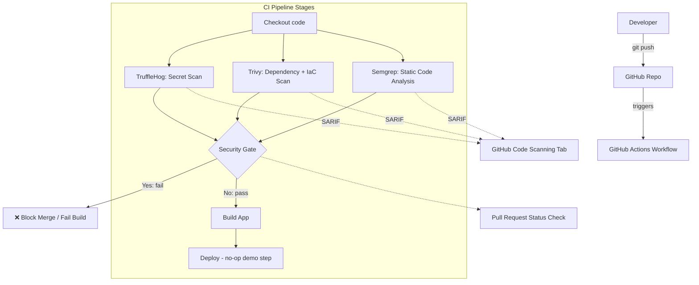

# Automated DevSecOps Pipeline Design

This document details the architecture, tool selection, and enforcement mechanisms for the DevSecOps CI/CD Security Pipeline.

## 1. Shift-Left Security Rationale

The traditional approach to security relies on scanning applications *after* they are built or deployed (DAST/Penetration testing). The **Shift-Left** model moves security checks as early in the Software Development Life Cycle (SDLC) as possible—directly into the developer's pull request workflow.

By failing the CI/CD pipeline when high-severity issues are found, we prevent vulnerabilities from ever reaching the main branch or production.

## 2. Architecture

## 3. Tool Selection

| Capability | Tool | Justification |
|------------|------|---------------|
| Secret Scanning | **TruffleHog** | Scans full git history (diffs), not just the working tree. Catches secrets that were committed and subsequently deleted. |
| Dependency / SCA | **Trivy** | Fully open source (Apache-2.0), extremely fast, natively outputs SARIF. *Note: We specifically selected Trivy over Snyk to achieve the same capability class with a 100% open-source tool.* |
| SAST | **Semgrep** | Fast, lightweight, and uses the `p/security-audit` community ruleset. We run the CLI directly to avoid auth requirements of the deprecated Action. |
| Unified Reporting | **GitHub Code Scanning** | All tools (TruffleHog, Trivy, Semgrep) output SARIF format, which is uploaded to GitHub Code Scanning to display inline PR annotations. |

## 4. Branch Protection Setup

To enforce the Security Gate, branch protection rules must be configured in the GitHub repository settings.

**Instructions (Manual Configuration):**
1. Go to repository **Settings** -> **Branches**.
2. Click **Add branch ruleset** (or edit the existing rule for `main`).
3. Enable **Require a pull request before merging**.
4. Enable **Require status checks to pass before merging**.
5. Search for and require the `Security Gate` status check.
   *(Note: The pipeline must run at least once on a PR before the check appears in the list.)*

This ensures that developers cannot bypass the pipeline, and the `Security Gate` job dictates whether the code is mergeable.

## 5. Exception Management (`.trivyignore`)

Not all findings are true positives, and sometimes a vulnerable package cannot be updated immediately due to breaking changes. We use a documented exception process.
Exceptions for Trivy are placed in `.trivyignore`. Every exception must include a comment explaining the justification and approval date.
