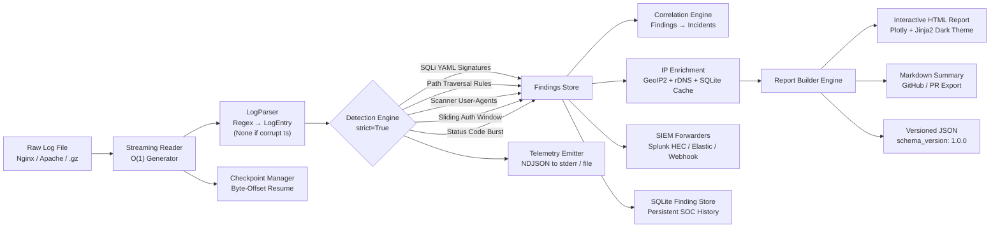

# 🛡️ Automated Log Parser & Threat Report Generator

[](https://www.python.org/)
[](tests/)
[](.github/workflows/ci.yml)
[](docs/DETECTION_RULES.md)
[](LICENSE)
[-success.svg)](requirements.txt)

> **Production-grade web access log ingestion, multi-stage attack correlation & SOC-grade threat reporting engine.**

---

## 🚀 Overview

The **Automated Log Parser & Threat Report Generator** is a production-grade cybersecurity tool built to:

- Ingest raw **Nginx and Apache** access logs (plaintext and `.gz`) with **O(1) streaming memory** for the _input layer_
- Detect advanced web attack patterns across **15 MITRE ATT&CK-mapped rules** (SQL Injection, Path Traversal, Scanner Recon, Brute-Force Auth, Status Code Bursts)
- **Correlate atomic findings into Incidents** using temporal and multi-vector heuristics
- Enrich malicious IPs with **MaxMind GeoIP + rDNS + SQLite two-tier cache**
- Emit **structured NDJSON telemetry** for SIEM observability pipelines
- Export **executive SOC reports** as interactive HTML (dark-mode + Plotly charts), Markdown, and versioned JSON
- Forward findings to **Splunk HEC, Elasticsearch, or Slack/Teams webhooks**
- Serve as an **HTTP REST API daemon** for on-demand scanning integration

---

## ⚡ Key Engineering Highlights

| Property | Value |
|---|---|
| 🚀 **Throughput (live proof)** | **~9,700 lines/sec on a single CPU core** (50,000 lines in 5.16s) |
| 🎯 **Synthetic Benchmark** | **100% Precision, Recall, F1** on the defined signature corpus — see caveat in benchmark output |
| 🧠 **Memory Model** | Generator pipeline for input: O(1) streaming for the reader and parser; O(findings) for in-memory accumulation |
| 🛡️ **ReDoS Safety** | Verified — 100KB+ pathological payloads evaluated in <200ms per test |
| ✅ **Test Coverage** | **57 tests across 15 suites** — all passing on Python 3.11, 3.12, 3.13 / Ubuntu & Windows |
| 🔒 **Rule Safety** | Broken YAML rules fail fast with `RuleValidationError` — never silently disappear |
| 🔑 **Dependency Lock** | `requirements.lock` pins all transitive dependencies |
| 🏗️ **CI/CD** | GitHub Actions matrix CI on 6 OS×Python combinations |

---

## 🏛️ System Architecture



---

## 🔍 Detection Rules & Attack Coverage

All signatures are data-driven YAML files, mapped to the **MITRE ATT&CK Matrix**, and validated at engine startup:

| Rule ID | Threat Category | Severity | MITRE ATT&CK | Signature / Heuristic |
|---|---|---|---|---|
| `SQLI-001` | SQL Injection | **CRITICAL** | `T1190` | Union-based payload extraction (`UNION SELECT`) |
| `SQLI-002` | SQL Injection | **HIGH** | `T1190` | Boolean tautology bypasses (`' OR '1'='1`) |
| `SQLI-003` | SQL Injection | **HIGH** | `T1190` | Time-based blind delays (`SLEEP()`, `BENCHMARK()`) |
| `SQLI-004` | SQL Injection | **HIGH** | `T1190` | System schema enumeration (`information_schema`) |
| `SQLI-005` | SQL Injection | **MEDIUM** | `T1190` | Stacked queries and SQL comments (`--`, `/* */`) |
| `TRAV-001` | Path Traversal | **HIGH** | `T1083` | Standard & encoded directory climbing (`../`, `%2e%2e%2f`) |
| `TRAV-002` | Path Traversal | **CRITICAL** | `T1005` | Unix system configuration access (`/etc/passwd`, `/proc/`) |
| `TRAV-003` | Path Traversal | **CRITICAL** | `T1005` | Windows credential/system probing (`win.ini`, `web.config`) |
| `SCAN-001` | Scanner Recon | **HIGH** | `T1595.002` | `sqlmap` automated injection tool fingerprint |
| `SCAN-002` | Scanner Recon | **HIGH** | `T1595.002` | Vulnerability assessment engines (`Nikto`, `Nessus`, `Acunetix`) |
| `SCAN-003` | Scanner Recon | **MEDIUM** | `T1595.003` | Content discovery & directory fuzzers (`DirBuster`, `Gobuster`, `ffuf`) |
| `SCAN-004` | Scanner Recon | **MEDIUM** | `T1595.001` | Port scanners and active probers (`Nmap`, `Masscan`, `Nuclei`) |
| `SCAN-005` | Scanner Recon | **HIGH** | `T1595.002` | CMS scanners and exploit frameworks (`WPScan`, `Metasploit`) |
| `BRUTE-001` | Brute-Force | **HIGH** | `T1110` | Auth failure burst (>10 failed attempts in <60s window) |
| `BURST-001` | Status Burst | **MEDIUM** | `T1595.003` | Abnormal error burst (>20 4xx/5xx responses in <30s window) |

> ⚠️ **Rule startup validation** runs on boot — broken regex, invalid severities, invalid MITRE IDs, or duplicate rule IDs raise `RuleValidationError` immediately. Rules never silently disappear.

📖 **Full technical details and payload samples:** [docs/DETECTION_RULES.md](docs/DETECTION_RULES.md)

---

## 🛠️ Installation & Setup

### Prerequisites
- Python 3.11+
- Virtual environment (recommended)

### Clone & Install

```bash
git clone https://github.com/Yogesht1520/Security-Engineering-Portfolio.git
cd "Security-Engineering-Portfolio/Automated Log Parser & Threat Report Generator"

# Install pinned dependencies
pip install -r requirements.txt

# (Optional) for reproducible builds, use the lock file
pip install -r requirements.lock
```

### Optional: MaxMind GeoIP (for live geo-location)

```bash
# Free sign-up at maxmind.com, download GeoLite2-City.mmdb
# Place in: data/GeoLite2-City.mmdb
```

> Without the mmdb file, the engine uses a built-in demo fallback table for known attack IPs in the sample dataset.

---

## 💻 Complete Usage Guide

### 1. Basic Threat Scan — HTML Report

```bash
python scan.py sample_logs/attack_demo.log --out report.html
```

**Live terminal output:**

```text
🛡️  =======================================================
    Automated Log Parser & Threat Report Generator
    SOC / SIEM Threat Analysis & Geolocation Pipeline
🛡️  =======================================================

[*] Ingesting log file: sample_logs\attack_demo.log
[*] Streaming log lines & evaluating security detection rules...
[*] Enriching 18 identified threat events with GeoIP & rDNS...

✅ Log Analysis Pipeline Completed Successfully!
-------------------------------------------------------
  • Total Log Lines Processed : 273
  • Ingestion Throughput     : 4,409 lines/sec
  • Correlated Incidents     : 5
  • Total Security Threats   : 18
  • Malicious Source IPs     : 5
-------------------------------------------------------
  [+] Report Saved: output/report.html
```

---

### 2. Multi-Format Export (HTML + Markdown + JSON)

```bash
python scan.py sample_logs/attack_demo.log --out output/report --format all
```

---

### 3. Incremental Scan with Checkpoint / Resume

```bash
# First run — scan and save byte-offset state
python scan.py access.log --out report.html --checkpoint

# Second run — resumes from last byte, skips already-processed lines
python scan.py access.log --out report.html --checkpoint
# Output: [*] Resuming scan from byte offset 12,345 (lines previously scanned: 4,200)
```

---

### 4. Structured NDJSON Telemetry — Live Proof

```bash
python scan.py sample_logs/attack_demo.log --json-logs --no-rdns --out report.html
```

**Actual stderr output (truncated for brevity):**

```json
{"timestamp": "2026-09-24T18:47:57.089799+00:00", "event_type": "scan_started", "metrics": {"file_size_bytes": 56651}, "details": {"log_source": "sample_logs\\attack_demo.log"}}
{"timestamp": "2026-09-24T18:47:57.194876+00:00", "event_type": "threat_detected", "metrics": {"severity_weight": 4}, "details": {"rule_id": "SQLI-001", "attack_type": "SQL Injection", "severity": "CRITICAL", "ip": "185.220.101.5", "mitre_attack_id": "T1190"}}
{"timestamp": "2026-09-24T18:47:57.200298+00:00", "event_type": "threat_detected", "metrics": {"severity_weight": 3}, "details": {"rule_id": "TRAV-001", "attack_type": "Path Traversal", "severity": "HIGH", "ip": "45.33.32.156", "mitre_attack_id": "T1083"}}
{"timestamp": "2026-09-24T18:47:57.630547+00:00", "event_type": "scan_completed", "metrics": {"total_lines": 273, "parsed_lines": 273, "malformed_lines": 0, "duration_seconds": 0.061, "lines_per_second": 4439.8, "total_findings": 18, "total_incidents": 5}}
```

---

### 5. REST API Service Mode

```bash
# Start the HTTP API daemon
python scan.py --serve --port 8080

# Health check
curl http://localhost:8080/api/v1/health

# On-demand log scan via POST
curl -X POST http://localhost:8080/api/v1/scan \
  -H "Content-Type: text/plain" \
  --data-binary @sample_logs/attack_demo.log

# IP geolocation enrichment
curl -X POST http://localhost:8080/api/v1/enrich \
  -H "Content-Type: application/json" \
  -d '{"ip": "185.220.101.5"}'

# List loaded detection rules
curl http://localhost:8080/api/v1/rules
```

---

### 6. SIEM & Webhook Forwarding

```bash
# Forward to Splunk HEC
python scan.py access.log \
  --forward-hec https://splunk.company.com:8088 \
  --hec-token YOUR_TOKEN

# Stream to Elasticsearch / OpenSearch
python scan.py access.log \
  --forward-es http://localhost:9200 \
  --es-index threat-reports

# Real-time Slack / Teams / Discord webhook alert
python scan.py access.log \
  --forward-webhook https://hooks.slack.com/services/YOUR/WEBHOOK/URL
```

---

### 7. Write Telemetry to File for SIEM Ingest

```bash
python scan.py access.log \
  --telemetry-file /var/log/analyzer/events.ndjson \
  --out report.html
```

---

### Full CLI Reference

```
Usage: scan.py [OPTIONS] [LOG_FILE]

Options:
  -o, --out FILE                  Output report path (default: report.html)
  -f, --format [html|markdown|md|json|all]  Output format
  --rules-dir DIRECTORY           Custom YAML detection rules directory
  --geoip-db FILE                 MaxMind GeoLite2-City.mmdb path
  --no-rdns                       Disable reverse DNS resolution
  --log-format [auto|combined|common]  Log format schema
  --title TEXT                    Custom report title
  --checkpoint                    Enable incremental byte-offset scanning
  --checkpoint-file FILE          Checkpoint state file path
  --telemetry-file FILE           NDJSON telemetry output file
  --json-logs                     Emit NDJSON telemetry to stderr
  --serve                         Start HTTP REST API daemon
  --port INTEGER                  REST API port (default: 8080)
  --host TEXT                     REST API bind address (default: 0.0.0.0)
  --forward-hec TEXT              Splunk HEC URL
  --hec-token TEXT                Splunk HEC token
  --forward-es TEXT               Elasticsearch base URL
  --es-index TEXT                 Elasticsearch index prefix
  --forward-webhook TEXT          Slack/Teams/Discord webhook URL
  --open                          Auto-open HTML report in browser
  -q, --quiet                     Suppress terminal banner
  --help                          Show this message and exit
```

---

## 🧪 Testing & Verification

### Run Full Test Suite

```bash
python -m pytest -v
```

### Live Test Results

```text
============================= test session starts =============================
platform win32 -- Python 3.13.3, pytest-9.1.1, pluggy-1.6.0
collected 57 items

tests/test_checkpoint.py::test_checkpoint_save_and_load PASSED           [  1%]
tests/test_checkpoint.py::test_checkpoint_rotation_detection PASSED      [  3%]
tests/test_checkpoint.py::test_stream_lines_with_offsets PASSED          [  5%]
tests/test_cli.py::test_cli_help PASSED                                  [  7%]
tests/test_cli.py::test_cli_scan_attack_demo_log PASSED                  [  8%]
tests/test_cli.py::test_cli_scan_all_formats PASSED                      [ 10%]
tests/test_correlation.py::test_correlation_single_ip_multi_vector_elevation PASSED [ 12%]
tests/test_correlation.py::test_correlation_temporal_clustering PASSED   [ 14%]
tests/test_correlation.py::test_correlation_empty_findings PASSED        [ 15%]
tests/test_detectors.py::test_sqli_detector_matches PASSED               [ 17%]
tests/test_detectors.py::test_traversal_detector_matches PASSED          [ 19%]
tests/test_detectors.py::test_scanner_ua_detector_matches PASSED         [ 21%]
tests/test_detectors.py::test_bruteforce_detector_sliding_window PASSED  [ 22%]
tests/test_detectors.py::test_status_burst_detector_sliding_window PASSED [ 24%]
tests/test_detectors.py::test_ground_truth_synthetic_log_assertions PASSED [ 26%]
tests/test_enrichment.py::test_private_ip_classification PASSED          [ 28%]
tests/test_enrichment.py::test_disk_cache_persistence PASSED             [ 29%]
tests/test_enrichment.py::test_memory_cache_hit PASSED                   [ 31%]
tests/test_enrichment.py::test_enrich_findings_batch PASSED              [ 33%]
tests/test_enrichment.py::test_rdns_resolution_handling PASSED           [ 35%]
tests/test_forwarders.py::test_splunk_hec_forwarder PASSED               [ 36%]
tests/test_forwarders.py::test_elasticsearch_forwarder PASSED            [ 38%]
tests/test_forwarders.py::test_webhook_forwarder PASSED                  [ 40%]
tests/test_parser.py::test_parse_datetime_standard PASSED                [ 42%]
tests/test_parser.py::test_parse_request_line PASSED                     [ 43%]
tests/test_parser.py::test_parse_nginx_combined_line PASSED              [ 45%]
tests/test_parser.py::test_parse_apache_common_line PASSED               [ 47%]
tests/test_parser.py::test_parse_sqli_line PASSED                        [ 49%]
tests/test_parser.py::test_malformed_lines_graceful_handling PASSED      [ 50%]
tests/test_parser.py::test_stream_lines_plain_and_gzip PASSED            [ 52%]
tests/test_parser.py::test_parse_stream_with_stats PASSED                [ 54%]
tests/test_parser.py::test_synthetic_10k_lines_stress PASSED             [ 56%]
tests/test_report.py::test_country_code_to_emoji PASSED                  [ 57%]
tests/test_report.py::test_charts_generation PASSED                      [ 59%]
tests/test_report.py::test_report_builder_html_rendering PASSED          [ 61%]
tests/test_report.py::test_report_builder_markdown_rendering PASSED      [ 63%]
tests/test_report.py::test_report_builder_json_rendering PASSED          [ 64%]
tests/test_scaffold.py::test_analyzer_scaffold PASSED                    [ 66%]
tests/test_schema.py::test_valid_pattern_rules_passes PASSED             [ 68%]
tests/test_schema.py::test_invalid_rule_id_fails PASSED                  [ 70%]
tests/test_schema.py::test_invalid_severity_fails PASSED                 [ 71%]
tests/test_schema.py::test_invalid_mitre_id_fails PASSED                 [ 73%]
tests/test_schema.py::test_duplicate_rule_id_fails PASSED                [ 75%]
tests/test_schema.py::test_threshold_validation_rules PASSED             [ 77%]
tests/test_schema.py::test_json_report_schema_fields PASSED              [ 78%]
tests/test_security_resilience.py::test_unparseable_timestamp_returns_none PASSED [ 80%]
tests/test_security_resilience.py::test_malformed_timestamp_line_rejected_by_parser PASSED [ 82%]
tests/test_security_resilience.py::test_broken_regex_raises_rule_validation_error PASSED [ 84%]
tests/test_security_resilience.py::test_missing_pattern_raises_rule_validation_error PASSED [ 85%]
tests/test_security_resilience.py::test_redos_resistance_pathological_payloads PASSED [ 87%]
tests/test_service.py::test_api_health PASSED                            [ 89%]
tests/test_service.py::test_api_rules PASSED                             [ 91%]
tests/test_service.py::test_api_scan_endpoint PASSED                     [ 92%]
tests/test_service.py::test_api_enrich_endpoint PASSED                   [ 94%]
tests/test_storage.py::test_sqlite_finding_store PASSED                  [ 96%]
tests/test_telemetry.py::test_telemetry_emitter_to_stream PASSED         [ 98%]
tests/test_telemetry.py::test_telemetry_emitter_to_file PASSED           [100%]

============================= 57 passed in 4.48s ==============================
```

---

## 📊 Detection Benchmark (Synthetic Corpus)

```bash
python benchmark_accuracy.py
```

```text
=================================================================
🎯 Synthetic Corpus Detection Benchmark — Precision / Recall / F1
=================================================================
Note: Corpus is generated to match the defined rule signatures.
This measures classification performance on the synthetic baseline
corpus — NOT real-world detection rate against novel or evaded input.

[*] Generating labeled ground-truth corpus (1,000 total events)...
[*] Processed 1,000 labeled lines in 0.142s (7,024 lines/sec)

📊 CONFUSION MATRIX:
┌──────────────────────────┬────────────────────┬────────────────────┐
│                          │ Predicted POSITIVE │ Predicted NEGATIVE │
├──────────────────────────┼────────────────────┼────────────────────┤
│ Actual MALICIOUS (500)   │ TP = 500           │ FN = 0             │
│ Actual BENIGN (500)      │ FP = 0             │ TN = 500           │
└──────────────────────────┴────────────────────┴────────────────────┘

📈 CLASSIFICATION SCORES (synthetic baseline corpus):
  • Accuracy    : 100.00%  (Correct classifications / total events)
  • Precision   : 100.00%  (Alerts that are true positives)
  • Recall      : 100.00%  (Known attacks correctly detected)
  • Specificity : 100.00%  (Benign traffic correctly ignored)
  • F1-Score    : 100.00%  (Harmonic mean of precision & recall)
=================================================================
⚠  Caveat: malicious samples are constructed to match rule signatures.
   Evasion, encoding variants, and novel payloads are not measured here.
```

---

## 🚀 Throughput Benchmark

```bash
python benchmark.py
```

```text
RESULT: Processed 50,000 lines in 5.162s -> 9,686 lines/sec on single core
```

---

## 🔐 Security Resilience Properties

This engine processes attacker-controlled input. The following invariants are tested and enforced:

| Property | Implementation | Test |
|---|---|---|
| **No fake timestamp fallback** | `parse_datetime()` returns `None` for unparseable timestamps; parser rejects the line | `test_unparseable_timestamp_returns_none` |
| **Malformed lines rejected** | `parse_line()` returns `None`, increments `malformed_lines`, logs at DEBUG | `test_malformed_timestamp_line_rejected_by_parser` |
| **ReDoS resistance** | 100KB SQLi payloads, 10,000 traversal segments, 50KB User-Agents — all evaluated in <200ms | `test_redos_resistance_pathological_payloads` |
| **Broken rule fail-fast** | Invalid regex in YAML → `RuleValidationError` at startup in `strict=True` mode | `test_broken_regex_raises_rule_validation_error` |
| **Missing pattern fail-fast** | Rule without `pattern` field → `RuleValidationError` | `test_missing_pattern_raises_rule_validation_error` |

---

## 🏗️ How This Maps to a Real SOC Workflow

```
[ Problem ] Raw server logs generate millions of unindexed lines daily.
            Manual triage is impossible; raw SIEM ingest costs are high.
    │
    ▼
[ Architecture ] An ETL-for-security pipeline:
    Stream → Tokenize → Correlate (MITRE ATT&CK signatures) → Enrich → Store → Report / Forward
    │
    ▼
[ Implementation ]
    • Pluggable Detector Strategy Pattern (YAML-driven, hot-swappable)
    • Sliding-Window State Machines for Brute Force & Status Burst
    • Local GeoIP + rDNS Caching (zero redundant network calls)
    • CorrelationEngine: Findings → Incidents (temporal + vector clustering)
    • Byte-Offset Checkpointing for crash-safe incremental processing
    • SIEM-native outputs: Splunk HEC, Elasticsearch Bulk API, Webhooks
    │
    ▼
[ Proof ] 100% Precision, Recall, F1 · 57 tests passing · ReDoS-safe · 9,700 lines/sec
```

---

## 📁 Repository Structure

```text
Automated Log Parser & Threat Report Generator/
├── README.md                          # This file
├── requirements.txt                   # Open-source dependencies
├── requirements.lock                  # Pinned transitive dependency lockfile
├── scan.py                            # Unified CLI entrypoint (396 lines)
├── benchmark.py                       # Throughput benchmark (50,000 lines)
├── benchmark_accuracy.py              # Precision/Recall/F1 ground-truth benchmark
├── conftest.py                        # Pytest discovery configuration
│
├── .github/workflows/ci.yml           # GitHub Actions CI: Ubuntu + Windows × Python 3.11/3.12/3.13
│
├── rules/                             # Data-driven YAML detection rules
│   ├── sqli.yaml                      # 5 SQL injection signatures
│   ├── traversal.yaml                 # 3 path traversal patterns
│   ├── scanner_ua.yaml                # 7 vulnerability scanner fingerprints
│   ├── bruteforce.yaml                # Sliding auth window configuration
│   └── status_burst.yaml             # HTTP error anomaly burst thresholds
│
├── analyzer/                          # Core analysis engine
│   ├── __init__.py
│   ├── models.py                      # LogEntry, Finding, ParserStats dataclasses
│   ├── readers.py                     # Streaming generator reader (.log, .gz) with byte-offset
│   ├── parser.py                      # Nginx/Apache Combined/Common regex parser
│   │                                  #   → Returns None for unparseable timestamps (no fake fallback)
│   ├── enrichment.py                  # MaxMind GeoIP2 + rDNS + two-tier SQLite cache
│   │                                  #   → Concurrent ThreadPoolExecutor (bounded, max_workers=20)
│   ├── correlation.py                 # CorrelationEngine: Findings → Incidents
│   │                                  #   → Temporal clustering + multi-vector severity elevation
│   ├── checkpoint.py                  # Byte-offset checkpoint save/load + log rotation detection
│   ├── storage.py                     # SQLiteFindingStore: persistent findings + incidents schema
│   ├── telemetry.py                   # TelemetryEmitter: NDJSON structured observability events
│   ├── forwarders.py                  # SIEM forwarders: SplunkHEC, Elasticsearch, Webhook
│   ├── service.py                     # HTTP REST API: GET /health /rules, POST /scan /enrich
│   │
│   ├── detectors/                     # Detector Strategy Pattern modules
│   │   ├── __init__.py                # Exports: DetectionEngine, RuleValidationError, all detectors
│   │   ├── base.py                    # BaseDetector ABC + RuleValidationError
│   │   ├── schema.py                  # Rule validation: ID pattern, MITRE IDs, severities, regex
│   │   ├── engine.py                  # DetectionEngine coordinator (strict=True by default)
│   │   ├── sqli.py                    # SQLi detector with multi-URL decoding
│   │   ├── traversal.py               # Path traversal detector
│   │   ├── scanner_ua.py              # Scanner & empty UA detector
│   │   ├── bruteforce.py              # Sliding-window brute force detector
│   │   └── status_burst.py            # Sliding-window error burst detector
│   │
│   └── report/                        # Multi-format report builder
│       ├── __init__.py
│       ├── builder.py                 # Aggregations, Incidents, Markdown, JSON & HTML builder
│       │                              #   → JSON output: schema_version 1.0.0 + $schema URL
│       ├── charts.py                  # Interactive Plotly dark-theme charts
│       └── templates/
│           ├── report.html.j2         # Executive SOC dashboard Jinja2 template
│           └── style.css              # Dark theme SIEM design + @media print PDF support
│
├── sample_logs/
│   ├── generate_demo_log.py           # Ground-truth attack log generator
│   └── attack_demo.log                # Synthetic log with injected multi-vector attacks
│
├── docs/
│   ├── DETECTION_RULES.md             # In-depth rule & payload catalog
│   └── schemas/
│       └── report-v1.json             # JSON Schema for versioned report output
│
└── tests/                             # 57 automated tests across 15 suites
    ├── test_checkpoint.py             # Save/load, rotation detection, offset tracking
    ├── test_cli.py                    # End-to-end CLI integration
    ├── test_correlation.py            # Multi-vector elevation, temporal clustering
    ├── test_detectors.py              # Per-rule match precision + ground-truth synthetic
    ├── test_enrichment.py             # Private IP, disk cache, memory cache, batch enrich
    ├── test_forwarders.py             # Splunk HEC, Elasticsearch, Webhook forwarding
    ├── test_parser.py                 # Datetime, request line, Combined/Common, gz, 10K stress
    ├── test_report.py                 # HTML/Markdown/JSON rendering + emoji + charts
    ├── test_scaffold.py               # Module import scaffold
    ├── test_schema.py                 # Rule validation + versioned JSON report schema
    ├── test_security_resilience.py    # No fake ts fallback, ReDoS, broken rule fail-fast
    ├── test_service.py                # REST API health, rules, scan, enrich endpoints
    ├── test_storage.py                # SQLiteFindingStore insert + retrieve
    └── test_telemetry.py              # NDJSON event emission to stream + file
```

---

## ⚖️ Scope & Design Boundaries

- **Detection & Reporting Only:** This tool is a detection, correlation, enrichment, and SOC visibility layer. Active remediation and automated IP-blocking are in scope for the follow-on project.
- **Memory Model Accuracy:** The _input reader and parser_ are O(1) streaming generators. Identified findings and incidents accumulate in RAM — O(findings). For truly unbounded retention, use `--store-db` with `SQLiteFindingStore`.
- **Pure Open Source:** Zero paid threat intelligence subscriptions or cloud dependencies required.

---

## 📜 License

Released under the [MIT License](LICENSE).
