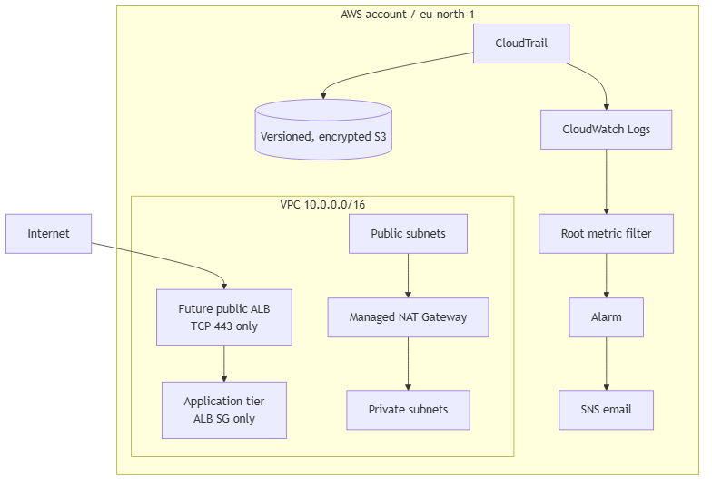

# Secure Corporate Cloud Environment

Terraform infrastructure-security portfolio project.

## Phase 0 status

Bootstrap complete once `terraform init` succeeds from this directory. No AWS resources are defined or created in this phase.

## Prerequisites

- Terraform 1.6 or later
- AWS CLI authenticated through the default credential chain
- Git

## Initialize

```powershell
terraform init
```

Do not commit Terraform state files or AWS credentials.

## Phase 1 cost warning

Phase 1 creates one managed NAT Gateway and an Elastic IP address. A NAT Gateway is a billable AWS resource while it exists, with hourly and data-processing charges. Apply the stack only for testing, capture your verification screenshots, then run `terraform destroy` immediately. Do not continue to later phases until the destroy completes successfully.

## Architecture



This project provisions a two-AZ VPC, a least-privilege future ALB/application security boundary, multi-Region CloudTrail logging, and direct root-account activity alerting.

## Security controls

| Control | Implementation |
| --- | --- |
| Segmentation | Two public and two private subnets across two AZs |
| Least privilege | TCP/443 public ingress only; application tier trusts the ALB security group only |
| Audit integrity | Multi-Region CloudTrail, log-file validation, versioned and SSE-S3 encrypted S3 |
| Root detection | CloudWatch Logs metric filter, alarm, and SNS email |

## Deploy and clean up

```powershell
Copy-Item terraform.tfvars.example terraform.tfvars
# Set admin_email in terraform.tfvars.
terraform init
terraform plan
terraform apply
terraform destroy
```

The NAT Gateway and CloudTrail-to-CloudWatch delivery are usage-billed. Apply only for short evidence capture, then destroy. See [cost breakdown](docs/COST_BREAKDOWN.md).

## Evidence captured

- CloudTrail logging, multi-Region configuration, and log-file validation
- CloudTrail JSON logs delivered to S3
- SSE-S3 default encryption and Terraform ownership tags
- SNS subscription confirmation, CloudWatch alarm, and root-activity alert email

## What I would change at scale

- Remote Terraform state with S3 and DynamoDB locking
- AWS Organizations, SCPs, and a dedicated security/log-archive account
- A NAT Gateway per AZ and governed log-retention policy
- AWS Config, GuardDuty, Security Hub, and CI security scanning
