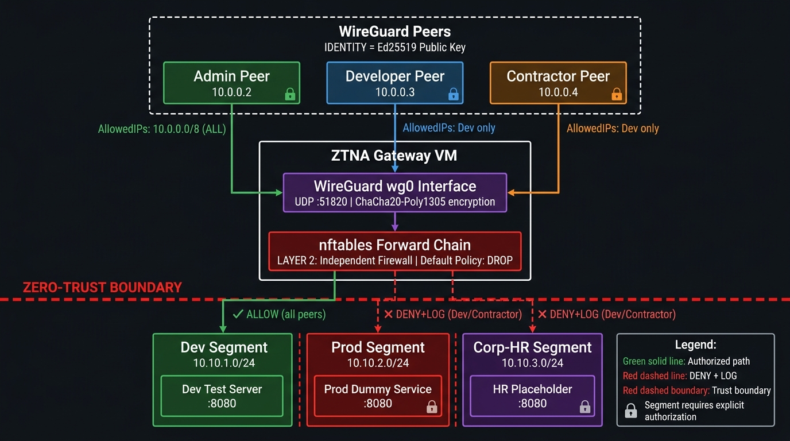

# Zero-Trust Network & VPN Topology Architecture

> **Portfolio Project** — Networking / GRC | Security Engineering  
> **Author:** Yogesh T  
> **Stack:** WireGuard (GPLv2) + nftables (GPLv2) + Linux network namespaces — 100% open-source, $0

---

## Hero Diagram



---

## What This Is (and Isn't)

This project builds a **real, working Zero-Trust Network Access (ZTNA) gateway** — not just a diagram. A WireGuard VPN server enforces per-peer, per-segment authorization at **two independent layers**, simulating dev/prod/corporate-HR network segmentation on a single free-tier cloud VM.

**This is NOT "connect to VPN = access everything."**  
Each peer is explicitly authorized only for the segments their role requires. Authorization is enforced twice:

| Layer | Mechanism | Who Controls It | Catchable By |
|-------|-----------|-----------------|--------------|
| **Layer 1** | WireGuard `AllowedIPs` | Client config | Layer 2 if misconfigured |
| **Layer 2** | `nftables` forward chain rules | Gateway server (server-side) | Cannot be bypassed from client |

The dual-layer model is what separates a "VPN project" from a genuine "zero-trust project." NIST SP 800-207 §2.1: *"Never trust a single control point."*

---

## Commercial Equivalent

| Commercial ZTNA Product | This Lab's Equivalent |
|-------------------------|----------------------|
| Zscaler Private Access (ZPA) | WireGuard tunnel + per-peer key identity |
| Cloudflare Access | `AllowedIPs` scoping (Layer 1) |
| Per-resource firewall policy | `nftables` forward chain (Layer 2) |
| Policy management plane | `SEGMENTATION_POLICY.md` |

This is the open-source pattern that commercial products are built on — they add a management plane, SSO, and auto-rotation. The network enforcement model is identical.

---

## Architecture

### Network Segments

| Segment | Subnet | Simulated With | Purpose |
|---------|--------|---------------|---------|
| Dev | `10.10.1.0/24` | Linux network namespace `ns-dev` | Development environment |
| Prod | `10.10.2.0/24` | Linux network namespace `ns-prod` | Production dummy service |
| Corp-HR | `10.10.3.0/24` | Linux network namespace `ns-hr` | HR data placeholder |

### Peer Access Matrix

| Peer | VPN IP | Dev | Prod | Corp-HR |
|------|--------|-----|------|---------|
| Admin | `10.0.0.2` | ✅ | ✅ | ✅ |
| Developer | `10.0.0.3` | ✅ | ❌ DENY+LOG | ❌ DENY+LOG |
| Contractor | `10.0.0.4` | ✅ | ❌ DENY+LOG | ❌ DENY+LOG |

Identity = WireGuard Ed25519 public key (cryptographic, not username/password).

---

## Repository Structure

```
.
├── README.md
├── diagrams/
│   └── network-topology.png          ← full architecture diagram
├── wireguard/
│   ├── server/
│   │   └── wg0.conf.example          ← server config (keys redacted)
│   ├── peers/
│   │   ├── admin.conf.example
│   │   ├── developer.conf.example
│   │   └── contractor.conf.example
│   └── generate_peer.sh              ← mint new peer keypair + config
├── firewall/
│   ├── nftables.conf                 ← Layer 2 enforcement rules (heavily commented)
│   └── logging.conf                  ← rsyslog routing for deny log evidence
├── scripts/
│   ├── phase0_provision.sh           ← create network namespaces + dummy services
│   ├── phase1_wireguard.sh           ← WireGuard server + Admin peer setup
│   ├── phase2_scoped_peers.sh        ← Developer + Contractor peers (restricted)
│   └── phase3_firewall.sh            ← nftables + deliberate misconfig test
├── docs/
│   ├── SEGMENTATION_POLICY.md        ← access matrix + rationale
│   ├── THREAT_MODEL.md               ← STRIDE analysis
│   └── TEST_EVIDENCE.md              ← screenshot + log evidence template
└── screenshots/
    ├── contractor-can-reach-dev.png
    ├── contractor-denied-prod.png
    └── firewall-deny-log.png
```

---

## Quick Start (on a Linux VM with root access)

```bash
# 1. Enter the project folder
cd "Zero-Trust Network & VPN Topology Architecture"

# 2. Phase 0 — Create segment namespaces + dummy services
sudo bash scripts/phase0_provision.sh setup

# 3. Phase 1 — WireGuard server + Admin peer
sudo bash scripts/phase1_wireguard.sh setup

# 4. Phase 2 — Developer + Contractor peers (restricted AllowedIPs)
sudo bash scripts/phase2_scoped_peers.sh setup

# 5. Phase 3 — nftables firewall rules
sudo bash scripts/phase3_firewall.sh setup

# 6. Phase 3 — DELIBERATE MISCONFIG TEST (the defense-in-depth proof)
sudo bash scripts/phase3_firewall.sh test-misconfig
```

---

## Phase 3 — The Key Test: Defense-in-Depth Proof

> **Definition of done from spec:** From a "contractor" peer, `ping`/`curl` to Dev succeeds, and to Prod or Corp-HR is explicitly refused — with logged firewall denies as evidence.

The Phase 3 misconfig test simulates an admin accidentally widening the contractor's `AllowedIPs` from `10.10.1.0/24` to `10.0.0.0/8`. This gives the contractor a tunnel route to ALL segments.

**Expected result:** nftables STILL blocks Prod and HR access and logs:

```
kernel: ZT-DENY-CONTRACTOR-PROD: IN=wg0 OUT=veth-ns-prod
  SRC=10.0.0.4 DST=10.10.2.2 PROTO=TCP DPT=8080
```

This proves the firewall layer operates **independently** — it sees the post-decryption source IP `10.0.0.4` and applies policy regardless of what the client's `AllowedIPs` says.

```bash
# Run the test
sudo bash scripts/phase3_firewall.sh test-misconfig

# Watch live deny events
sudo journalctl -kf | grep ZT-DENY

# Check nftables counters
sudo nft list table inet zt_filter | grep -A3 DENY
```

---

## Key Design Decisions

**Why network namespaces instead of separate VMs?**  
Free-tier cloud VMs are limited to 1. Namespaces give genuinely isolated L3 routing domains on a single host — the networking behavior is identical; only the administrative boundary differs.

**Why `nftables` over `iptables`?**  
`nftables` is the modern replacement (Linux ≥ 3.13, default since Debian 10/Ubuntu 20.04). Named sets make the rules DRY and easier to audit. `iptables` would work identically — the zero-trust enforcement logic is the same.

**Why `AllowedIPs` on the SERVER side scope to `/32`?**  
The server's `[Peer]` block `AllowedIPs = 10.0.0.4/32` controls which *source IPs* the WireGuard kernel module will accept from that peer's public key. A peer claiming to originate from any IP other than its assigned VPN IP will have packets silently dropped at the kernel level before they even reach nftables.

---

## References

- [WireGuard Whitepaper](https://www.wireguard.com/papers/wireguard.pdf)
- [NIST SP 800-207 — Zero Trust Architecture](https://csrc.nist.gov/publications/detail/sp/800-207/final)
- [nftables Wiki](https://wiki.nftables.org/wiki-nftables/index.php/Main_Page)
- [Linux Network Namespaces](https://man7.org/linux/man-pages/man7/network_namespaces.7.html)
