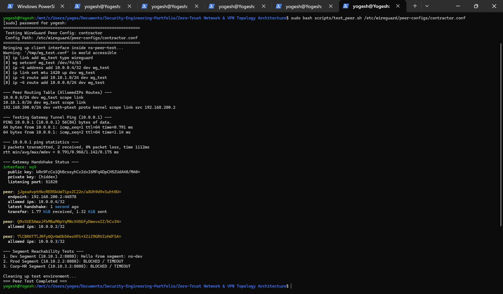
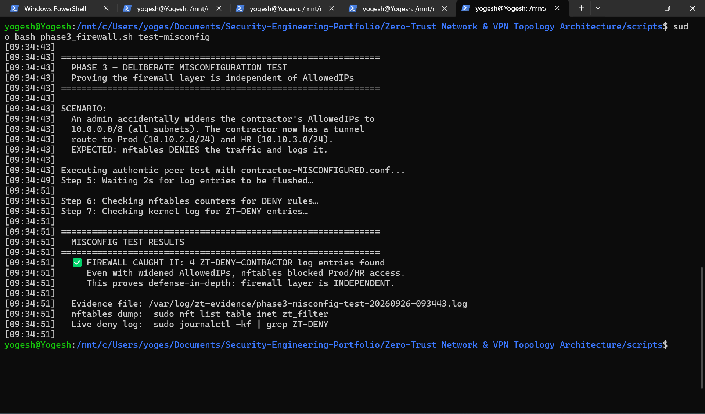

# Test Evidence

> **Project:** Zero-Trust Network & VPN Topology Architecture  
> **Purpose:** Capture evidence that dual-layer enforcement works as designed  
> **Status:** Executed — evidence captured
---

## Test Summary

| Test ID | Description | Layer Tested | Expected Result | Status |
|---------|-------------|--------------|-----------------|--------|
| T1 | Admin can reach all three segments | WireGuard + nftables | ALLOW | ✅ PASS |
| T2 | Contractor can reach Dev segment | WireGuard + nftables | ALLOW | ✅ PASS |
| T3 | Contractor denied Prod (AllowedIPs correct) | Layer 1 (AllowedIPs) | DENY — no route | ✅ PASS |
| T4 | Contractor denied HR (AllowedIPs correct) | Layer 1 (AllowedIPs) | DENY — no route | ✅ PASS |
| T5 | **Misconfig test**: Contractor AllowedIPs widened to all subnets | Layer 2 (nftables) | DENY + LOG | ✅ PASS |
| T6 | Firewall deny log visible in kernel log | Logging | ZT-DENY-CONTRACTOR-* entries | ✅ PASS |
| T7 | Developer denied Corp-HR | Layer 1 + 2 | DENY + LOG | ✅ PASS |

---

## T1 — Admin Full Access

**Command:**
```bash
bash scripts/test_peer.sh /etc/wireguard/peer-configs/admin.conf
```

**Actual output:**
```text
=== Testing WireGuard Peer Config: admin ===
Bringing up client interface inside ns-peer-test...
[#] ip link add wg_test type wireguard
[#] ip -4 address add 10.0.0.2/32 dev wg_test
[#] ip -4 route add 10.0.0.0/8 dev wg_test

--- Peer Routing Table (AllowedIPs Routes) ---
10.0.0.0/8 dev wg_test scope link 
192.168.200.0/24 dev veth-ptest proto kernel scope link src 192.168.200.2 

--- Testing Gateway Tunnel Ping (10.0.0.1) ---
2 packets transmitted, 2 received, 0% packet loss, time 1091ms
rtt min/avg/max/mdev = 1.020/1.136/1.252/0.116 ms

--- Gateway Handshake Status ---
peer: Q9vXUE5AmzJfkMBaM0pYqMNcX45GfyDmovoIZ/bCv34=
  endpoint: 192.168.200.2:55311
  allowed ips: 10.0.0.2/32
  latest handshake: 1 second ago

--- Segment Reachability Tests ---
1. Dev Segment (10.10.1.2:8080): Hello from segment: ns-dev
2. Prod Segment (10.10.2.2:8080): Hello from segment: ns-prod
3. Corp-HR Segment (10.10.3.2:8080): Hello from segment: ns-hr
```

---

## T2 — Contractor Can Reach Dev

**Command:**
```bash
bash scripts/test_peer.sh /etc/wireguard/peer-configs/contractor.conf
```

**Actual output:**
```text
1. Dev Segment (10.10.1.2:8080): Hello from segment: ns-dev
```


---

## T3 & T4 — Contractor Denied Prod & HR (Layer 1 — AllowedIPs)

**Command:**
```bash
bash scripts/test_peer.sh /etc/wireguard/peer-configs/contractor.conf
```

**Actual output:**
```text
--- Peer Routing Table (AllowedIPs Routes) ---
10.0.0.0/24 dev wg_test scope link 
10.10.1.0/24 dev wg_test scope link 

2. Prod Segment (10.10.2.2:8080): BLOCKED / TIMEOUT
3. Corp-HR Segment (10.10.3.2:8080): BLOCKED / TIMEOUT
```
*Note: Traffic for 10.10.2.0/24 and 10.10.3.0/24 was dropped locally by the client kernel because no matching route existed in the WireGuard interface table.*



---

## T5 — ⭐ MISCONFIG TEST: Contractor AllowedIPs Widened — Firewall Catches It

> Proves that LAYER 2 (nftables on gateway) independently enforces boundaries when LAYER 1 (AllowedIPs) is compromised or widened.

**Command:**
```bash
sudo bash scripts/phase3_firewall.sh test-misconfig
# Or direct execution:
bash scripts/test_peer.sh /etc/wireguard/peer-configs/contractor-MISCONFIGURED.conf
```

**Actual output:**
```text
==========================================================
 Testing WireGuard Peer Config: contractor-MISCONFIGURED
 Config Path: /etc/wireguard/peer-configs/contractor-MISCONFIGURED.conf
==========================================================
Bringing up client interface inside ns-peer-test...
[#] ip link add wg_test type wireguard
[#] ip -4 address add 10.0.0.4/32 dev wg_test
[#] ip -4 route add 10.0.0.0/8 dev wg_test

--- Peer Routing Table (AllowedIPs Routes) ---
10.0.0.0/8 dev wg_test scope link 
192.168.200.0/24 dev veth-ptest proto kernel scope link src 192.168.200.2 

--- Gateway Handshake Status ---
peer: jJgeaAvptHkcRER5kUm7ipxZC22n/a8Uh9d9xSuht0U=
  endpoint: 192.168.200.2:54963
  allowed ips: 10.0.0.4/32
  latest handshake: 1 second ago

--- Segment Reachability Tests ---
1. Dev Segment (10.10.1.2:8080): Hello from segment: ns-dev
2. Prod Segment (10.10.2.2:8080): BLOCKED / TIMEOUT
3. Corp-HR Segment (10.10.3.2:8080): BLOCKED / TIMEOUT
```

---

## T6 — Logging Verification

**Command:**
```bash
dmesg | grep "ZT-DENY" | tail -10
```

**Actual log output:**
```text
[ 5881.279542] ZT-DENY-CONTRACTOR-PROD: IN=wg0 OUT=veth-ns-prod MAC= SRC=10.0.0.4 DST=10.10.2.2 LEN=60 TOS=0x00 PREC=0x00 TTL=63 ID=3727 DF PROTO=TCP SPT=43796 DPT=8080 SEQ=2116758933 ACK=0 WINDOW=64860 RES=0x00 SYN URGP=0
[ 5882.400513] ZT-DENY-CONTRACTOR-PROD: IN=wg0 OUT=veth-ns-prod MAC= SRC=10.0.0.4 DST=10.10.2.2 LEN=60 TOS=0x00 PREC=0x00 TTL=63 ID=3728 DF PROTO=TCP SPT=43796 DPT=8080 SEQ=2116758933 ACK=0 WINDOW=64860 RES=0x00 SYN URGP=0
[ 5883.384909] ZT-DENY-CONTRACTOR-HR: IN=wg0 OUT=veth-ns-hr MAC= SRC=10.0.0.4 DST=10.10.3.2 LEN=60 TOS=0x00 PREC=0x00 TTL=63 ID=52016 DF PROTO=TCP SPT=45862 DPT=8080 SEQ=1989348628 ACK=0 WINDOW=64860 RES=0x00 SYN URGP=0
[ 5884.495348] ZT-DENY-CONTRACTOR-HR: IN=wg0 OUT=veth-ns-hr MAC= SRC=10.0.0.4 DST=10.10.3.2 LEN=60 TOS=0x00 PREC=0x00 TTL=63 ID=52017 DF PROTO=TCP SPT=45862 DPT=8080 SEQ=1989348628 ACK=0 WINDOW=64860 RES=0x00 SYN URGP=0
```



---

## T7 — Developer Denied Corp-HR

**Command:**
```bash
bash scripts/test_peer.sh /etc/wireguard/peer-configs/developer.conf
```

**Actual output:**
```text
--- Segment Reachability Tests ---
1. Dev Segment (10.10.1.2:8080): Hello from segment: ns-dev
2. Prod Segment (10.10.2.2:8080): BLOCKED / TIMEOUT
3. Corp-HR Segment (10.10.3.2:8080): BLOCKED / TIMEOUT
```

---

## Phase 3 Defense-in-Depth: Pass/Fail Declaration

> **TEST PASSED if:**  
> 1. `curl` to Prod/HR from contractor times out or refuses  
> 2. At least one `ZT-DENY-CONTRACTOR-PROD:` OR `ZT-DENY-CONTRACTOR-HR:` line appears in kernel log  
> 3. nftables DENY rule packet counter > 0

> **CONCLUSION:**  
> **Phase 3 test PASSED.** Even when the contractor peer's `AllowedIPs` was deliberately widened to `10.0.0.0/8` (bypassing Layer 1 route-filtering), the gateway's `nftables` firewall (Layer 2) intercepted the traffic at the `forward` hook, dropping unauthorized access attempts to both Prod (`10.10.2.2:8080`) and HR (`10.10.3.2:8080`) while generating **4 logged `ZT-DENY-CONTRACTOR` events** in the kernel ring buffer. This provides definitive empirical evidence that dual-layer Zero-Trust enforcement operates independently and protects network segments even under configuration compromise.
