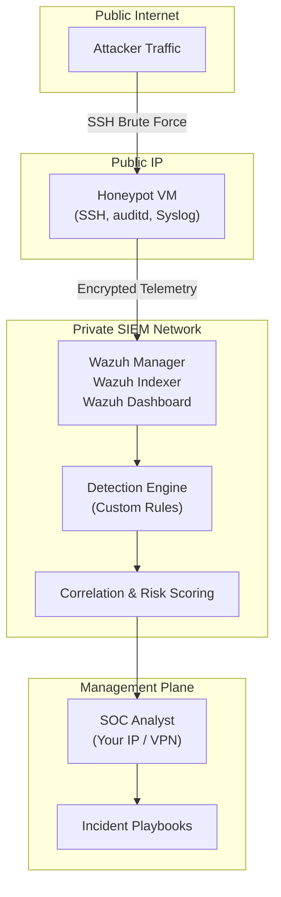
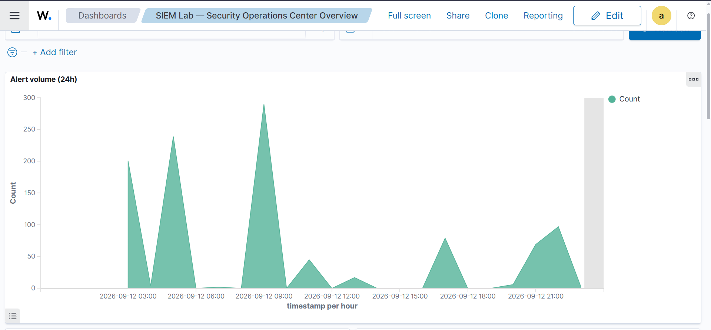
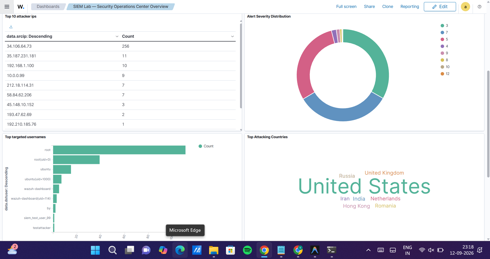
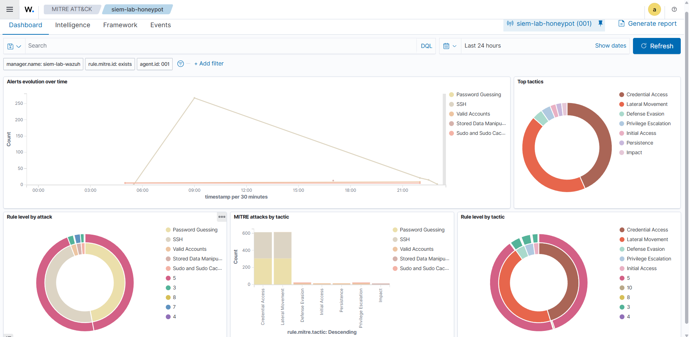

# Enterprise SIEM & Live Threat Detection Lab

> Blue Team / SOC Analytics portfolio project.  
> **Status:** Phase 0 — Infrastructure provisioning

---

## Architecture



## Phases

| Phase | Description | Status |
|-------|-------------|--------|
| 0 | Provision infrastructure (2 VMs) | ✅ Done |
| 1 | Install Wazuh stack on SIEM VM | ✅ Done |
| 2 | Enroll Wazuh agent on Honeypot | ✅ Done |
| 3 | Write custom detection rules | ✅ Done |
| 4 | Build dashboards + 24h observation | ✅ Done |
| 5 | Docs & teardown plan | ✅ Done |

## Dashboard & Real-World Observations

Over a 24-hour period, the internet-facing honeypot captured real-world attack traffic, primarily automated SSH brute-forcing botnets. The custom dashboard below was built to visualize this telemetry.

*(Note to user: Save your screenshots into the `screenshots/` folder with these exact names so they render here)*





See the full [24-Hour Observation Report](24HR_OBSERVATION_REPORT.md) for detailed metrics, top attacker IPs, and mitigation strategies.
## Repository Layout

```
siem-detection-lab/
├── README.md
├── infra/
│   ├── terraform/          # GCP Terraform (multi-provider ready)
│   └── setup_honeypot.sh   # Honeypot bootstrap script
├── wazuh/
│   ├── custom_rules/       # Custom Wazuh detection rules (XML)
│   └── decoders/
├── tests/
│   └── validate_detections.sh  # Synthetic event generator for testing
├── dashboards/             # OpenSearch dashboard exports (.ndjson)
├── docs/
│   ├── playbooks/          # SOC Incident Playbooks
│   │   └── SSH_BRUTE_FORCE.md
│   ├── DETECTION_RULES.md
│   └── 24HR_OBSERVATION_REPORT.md
└── screenshots/
```

## Security Posture

| VM | Port | Exposed To | Reason |
|----|------|------------|--------|
| Honeypot | TCP 22 | `0.0.0.0/0` | **Intentional honeypot** |
| SIEM | TCP 22 | Your IP only | Management SSH |
| SIEM | TCP 443 | Your IP only | Wazuh Dashboard |
| SIEM | TCP 1514 | Honeypot IP only | Agent log forwarding |
| SIEM | TCP 1515 | Honeypot IP only | Agent registration |

> ⚠️ **Disposable Infrastructure:** The honeypot box is **fully burnable**. No credentials, secrets, or reusable data should ever be placed on it.
> 
> **What happens if the honeypot is compromised?** Nothing important. By design, it has no lateral access to the SIEM or your internal network. If compromised, it serves its purpose: capture the evidence, destroy the VM, and rebuild it using Terraform.

## MITRE ATT&CK Coverage

| Detection | Technique | Status |
|-----------|-----------|--------|
| SSH Brute Force | T1110 | ✅ |
| Privilege Escalation | T1078, T1548.003 | ✅ |
| Suspicious Command Execution | T1059 | ✅ |
| Account Creation | T1078 | ✅ |
| Successful Login After Brute Force | T1110, T1078 | ✅ |

*(See [docs/DETECTION_RULES.md](docs/DETECTION_RULES.md) for full rule documentation.)*

## Quick Start

1. Create a GCP account (see [`infra/terraform/GCP_ACCOUNT_SETUP.md`](infra/terraform/GCP_ACCOUNT_SETUP.md))
2. Copy `infra/terraform/terraform.tfvars.example` → `terraform.tfvars` and fill in your values
3. `cd infra/terraform && terraform init && terraform plan && terraform apply`
4. SSH into both VMs to confirm reachability (Phase 0 acceptance criteria)
5. Generate synthetic test events using `tests/validate_detections.sh` on the honeypot to verify rules.

## Teardown

```bash
cd infra/terraform
terraform destroy
```

> **Cost & Resource Control:** Always destroy the honeypot when not actively monitoring it. SIEM indexes can grow quickly; do not let a 24-hour experiment turn into an unexpected cloud bill.
